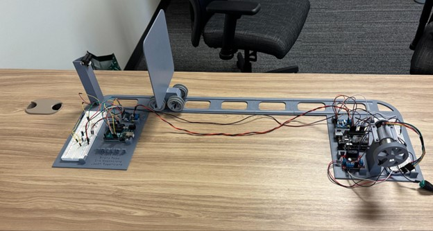
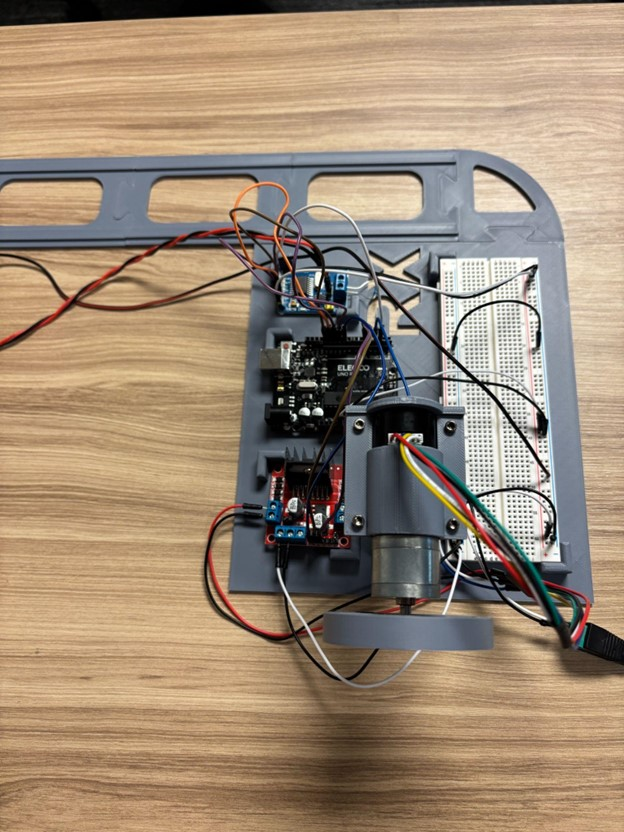
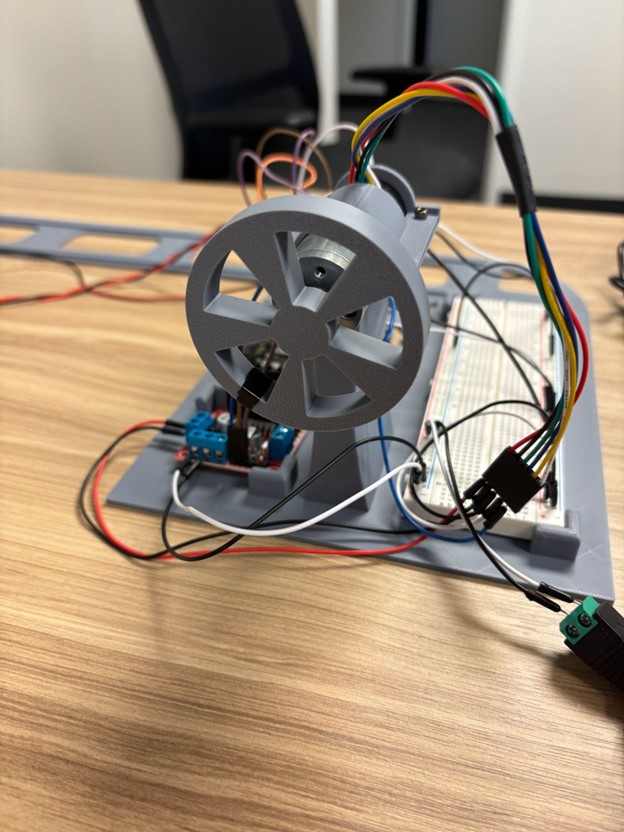

<h1>Adaptive Cruise Control and Forward Collision Avoidance using CAN</h1>

<h2>Description</h2>

This project implements a small-scale prototype of automotive adaptive cruise control (ACC) and forward collision avoidance (FCA) using the Controller Area Network (CAN) bus.

Two Arduino Uno R3 nodes communicate over a twisted-pair CAN bus through MCP2515 CAN controllers:

<ul>
  <li><b>Sensor (TX) node</b> reads distance from an IR range sensor, converts the analog voltage to distance in centimeters, and publishes the result in CAN frames at a fixed rate.</li>
  <li><b>Motor-control (RX) node</b> receives the distance frames, converts distance to a motor command, and sets the drive motor PWM:
    <ul>
      <li>Larger distance &rarr; higher PWM &rarr; faster motor.</li>
      <li>Smaller distance &rarr; lower PWM &rarr; slower motor.</li>
      <li>When distance &lt; 12&nbsp;cm, PWM is set to 0 so the motor stops to avoid collision.</li>
    </ul>
  </li>
</ul>

 

<h2>Languages and Libraries Used</h2>

<ul>
  <li><b>Arduino C/C++</b> (Arduino IDE)</li>
  <li><b>MCP2515 CAN library</b> for CAN controller configuration</li>
  <li><b>SPI</b> interface between Arduino and MCP2515</li>
  <li><b>Serial Monitor</b> for debugging distance, speed, and PWM commands</li>
</ul>

<h2>Hardware / Environments Used</h2>

<ul>
  <li><b>Arduino Uno R3 (TX)</b> – distance sensor / CAN sender node</li>
  <li><b>Arduino Uno R3 (RX)</b> – motor-control / CAN receiver node</li>
  <li><b>Two MCP2515 + TJA1050 CAN modules</b></li>
  <li><b>IR distance sensor</b> (front object detection)</li>
  <li><b>L298N dual H-bridge motor driver</b></li>
  <li><b>12 V DC motor with encoder</b></li>
  <li><b>Breadboard + 12 V supply</b></li>
</ul>

<h2>Program walk-through</h2>

<ol>
  <li>
    <b>Initialize CAN bus</b> 
    Both Arduinos configure the MCP2515 controllers (bit rate, filters, and masks) and print status to the Serial Monitor.
  </li>
   

  <li>
    <b>Read distance on the sensor node</b> 
    The TX node samples the IR distance sensor, converts the analog voltage (0–1023) to centimeters using a calibration curve, and stores the distance.
  </li>
   

  <li>
    <b>Transmit distance over CAN</b> 
    The TX node packs the distance into a CAN frame (ID + data bytes) and periodically sends distance frames on the CAN bus (for example, 20–50&nbsp;Hz).
  </li>
   

  <li>
    <b>Decode distance on the motor-control node</b> 
    The RX node reads CAN frames, extracts the distance, and classifies it into regions such as safe-following, slow-down, or stop.
  </li>
   

  <li>
    <b>Compute speed / stop command</b> 
    Based on distance, the RX node:
    <ul>
      <li>Maps distance to a target motor speed (rpm and approximate linear velocity).</li>
      <li>Sets the corresponding PWM value on the L298N motor driver.</li>
      <li>Sets PWM to 0 when the distance is below the 12&nbsp;cm stop threshold so the motor stops.</li>
    </ul>
  </li>
   

  <li>
    <b>Debug and tuning</b> 
    Both nodes print debug messages (analog voltage, distance, rpm, linear velocity, PWM) to help tune thresholds and verify correct CAN communication.  
    The “Software output” screenshot shows TX on the right (ADC + distance) and RX on the left (rpm, velocity, PWM).
  </li>
</ol>

<h2>Hardware photos</h2>

   
  <em>Full bench assembly: IR sensor and TX node on the left, CAN bus wiring, RX node, motor driver, and encoder motor on the right.</em>

   
  <em>Transmit side: IR distance sensor, Arduino Uno TX, MCP2515 CAN module, and breadboard.</em>

   
  <em>Receive side: Arduino Uno RX with MCP2515 CAN module and L298N motor driver.</em>

   
  <em>12&nbsp;V DC encoder motor and pulley used for speed control and distance tracking.</em>

<h2>Example software output</h2>

   
  <em>Serial output: right = transmit node (ADC + distance), left = receive node (rpm, linear velocity, PWM) for Range&nbsp;=&nbsp;14.</em>

